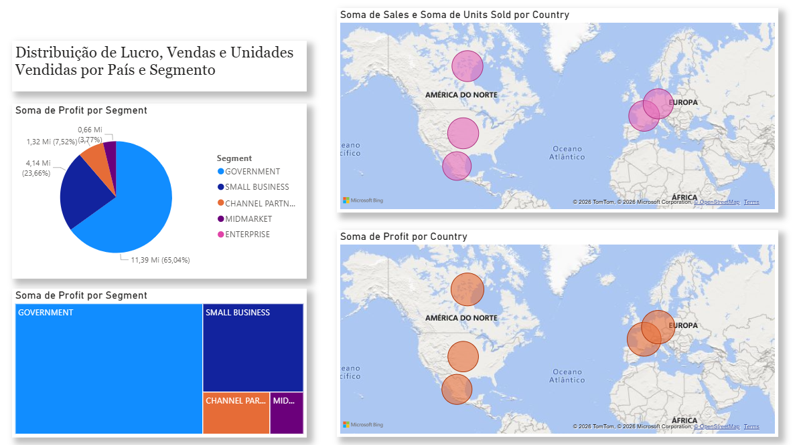

📊 Dashboard de Vendas - Power BI

Projeto desenvolvido como parte do desafio da formação Power BI Analyst da Digital Innovation One.

O objetivo foi replicar duas páginas de relatório apresentadas no curso e criar uma terceira página com novos visuais, utilizando os dados disponibilizados no repositório oficial do desafio.

🔗 Fonte de dados:
[julianazanelatto/power_bi_analyst](https://github.com/julianazanelatto/power_bi_analyst )

📊 Visuais Criados

A terceira página do relatório contém:

🌍 Mapa: Soma de Sales e Units Sold por país

🌍 Mapa: Soma de Profit por país

🥧 Gráfico de Pizza: Lucro (Profit) por segmento

🛠 Ferramentas Utilizadas

Microsoft Power BI

Git

GitHub
